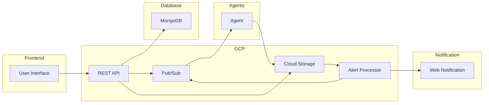

# Diagram

## Flowcharts

```mermaid
flowchart LR
    %% Frontend
    subgraph Frontend
        UI[User Interface]
    end

    %% Backend (GCP)
    subgraph GCP
        REST[REST API]
        Alert[Alert Processor]
        PubSub[Pub/Sub]
        CloudStorage[Cloud Storage]
    end

    %% Database
    subgraph Database
        MongoDB[MongoDB]
    end

    %% Agents
    subgraph Agents
        Agent[Agent]
    end

    %% Notifications
    subgraph Notification
        Pusher[Web Notification]
    end

    %% Relationships
    UI --> REST
    REST --> MongoDB
    REST --> PubSub
    REST --> CloudStorage
    CloudStorage --> Alert
    Alert --> PubSub
    Alert --> Pusher
    PubSub --> Agent
    Agent --> CloudStorage

```
